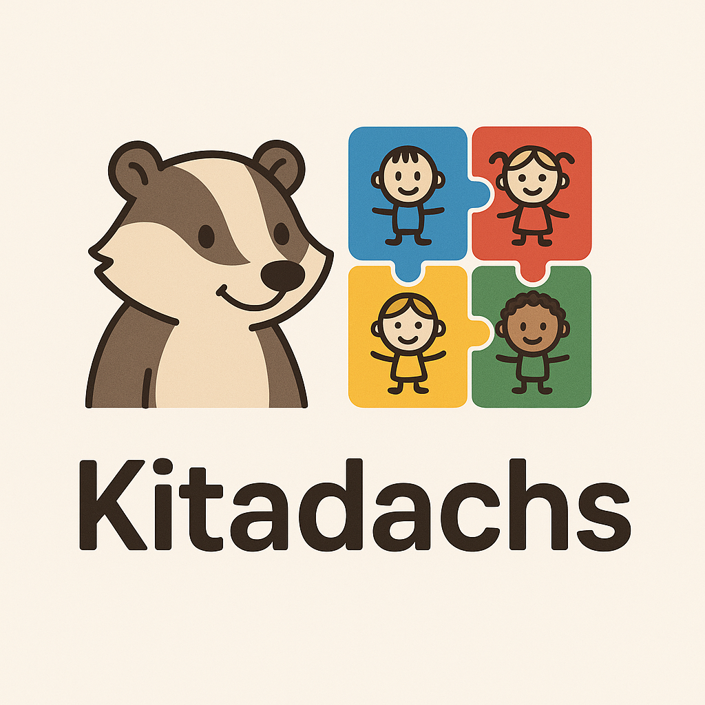

# Kitadachs



**Kitadachs** ist eine moderne Kindergarten-Verwaltungsanwendung für die digitale Verwaltung von Kindergarten-Gruppen. Einfach, sicher und vollständig DSGVO-konform.

**📄 [English Version](README.md)**

## 🚀 Live-Demo

Die Anwendung ist live verfügbar unter: **[GitHub Pages](https://patrickritter.github.io/kitadachs/)**

## License
This project is licensed under the [MIT License](./LICENSE).

## 🛠️ Technische Details

### Voraussetzungen
- **Node.js** 22.x oder höher
- **npm** (kommt mit Node.js)

### Lokale Entwicklung

1. **Repository klonen**
   ```bash
   git clone https://github.com/ihr-username/kitadachs.git
   cd kitadachs
   ```

2. **Dependencies installieren**
   ```bash
   npm install
   ```

3. **Entwicklungsserver starten**
   ```bash
   npm run dev
   ```
   
   Die Anwendung ist dann verfügbar unter: `http://localhost:5173`

4. **Weitere verfügbare Befehle**
   ```bash
   npm run build      # Produktions-Build erstellen
   npm run preview    # Build lokal testen
   npm run test       # Tests ausführen
   npm run lint       # Code-Qualität prüfen
   ```

## 🌐 Routing

- **`/`** - Landing Page
- **`/app`** - Hauptanwendung (Kindergarten-Verwaltung)

## 🚀 Deployment

Das Projekt wird automatisch über GitHub Actions auf GitHub Pages deployed:

- **Trigger**: Push auf `main` Branch

## 🔧 Tech Stack

- **Frontend**: React 18 + Vite
- **Routing**: React Router DOM
- **Styling**: CSS3
- **Testing**: Vitest + Testing Library
- **Linting**: ESLint
- **Deployment**: GitHub Pages + GitHub Actions

## 📱 Browser-Unterstützung

- ✅ Chrome
- ✅ Firefox  
- ✅ Edge

